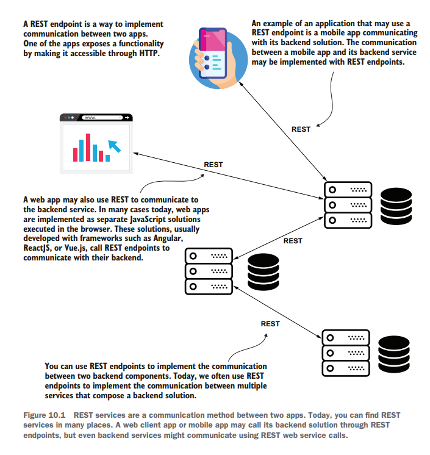
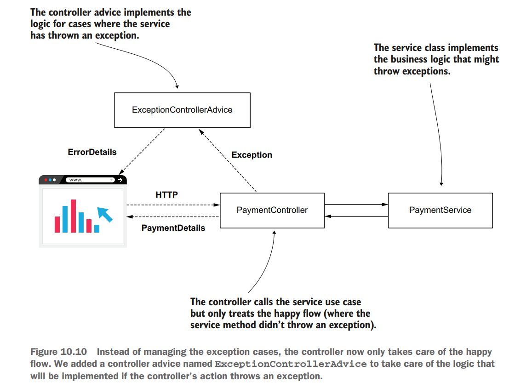

# Chapter 10 Implementing REST Services

REST stands for **RE**presentional **S**tate **T**ransfer  
REST offers access to the server's endpoints  

## HTTP STATUS CODES
- 200 - OK
- 400 - BAD REQUEST, server got a request in a way it did not expect
- 404 - NOT FOUND, requested resource DNE
- 500 - ERROR ON SERVER, expection on server side

## sq-ch10-ex5 Diagram

