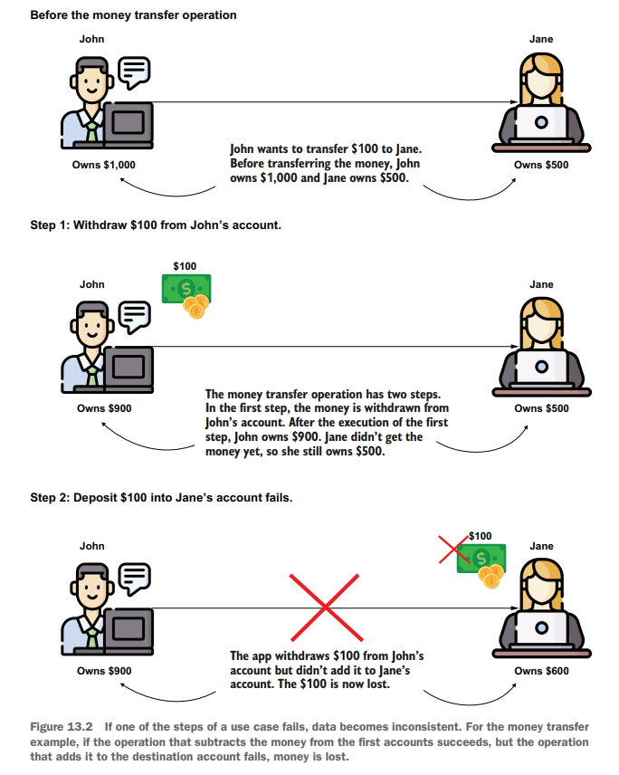

# Chapter 13 Using Transactions In Spring Apps

- Commit: A successful end of transaction
- Rollback: When app restores data to the way it looked at the beginning of a transcation because of inconsistent data

