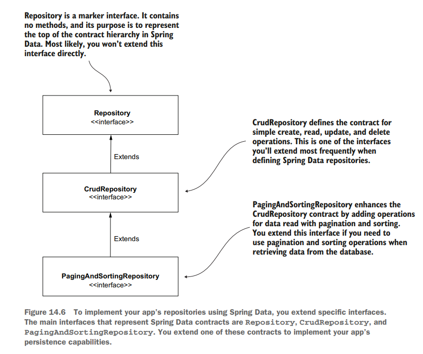

# Chapter 14 Implementing Data Persistence with Spring Data

- **NOTE Don’t confuse the @Repository annotation we discussed in chapter 4
with the Spring Data Repository interface. The @Repository annotation is
the stereotype annotation you use with classes to instruct Spring to add an
instance of the annotated class to the application context. This Repository
interface we discuss in this chapter is specific to Spring Data and, as you’ll
learn, you extend it or another interface that extends from it to define a
Spring Data repository.**

